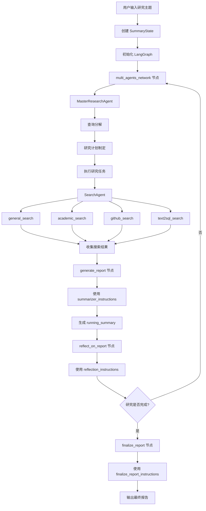
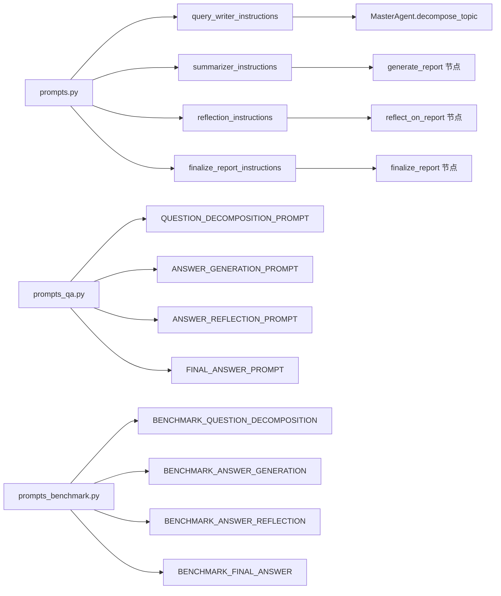
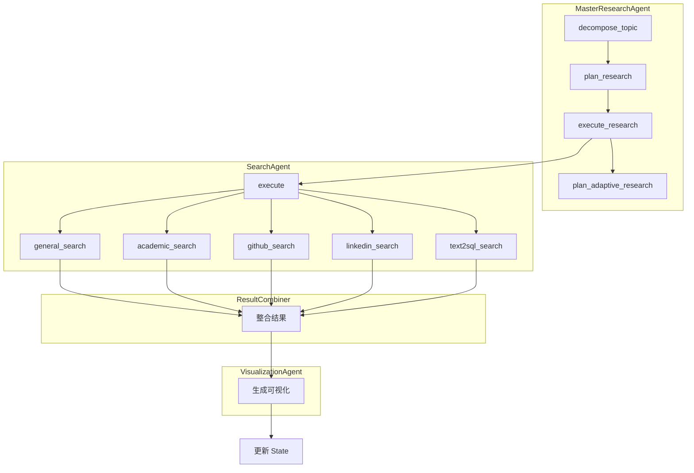
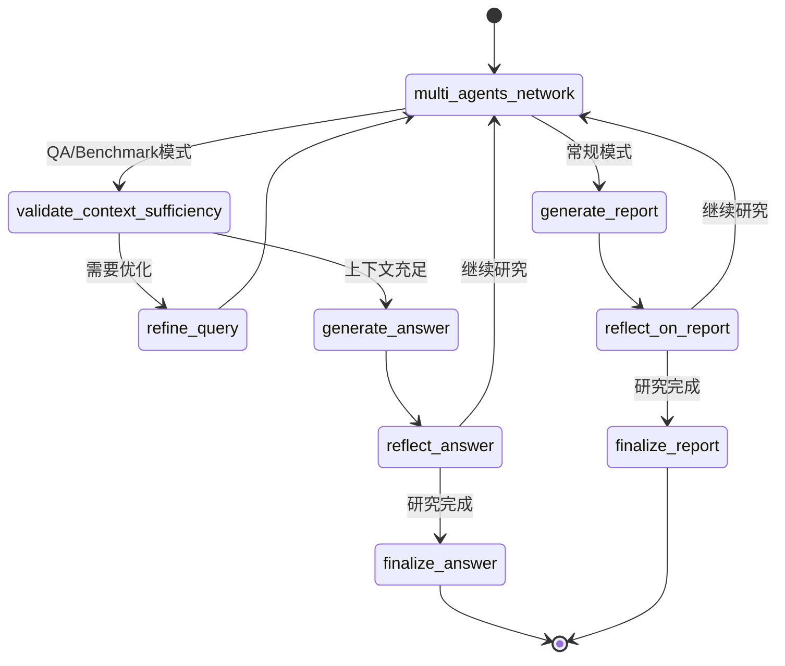
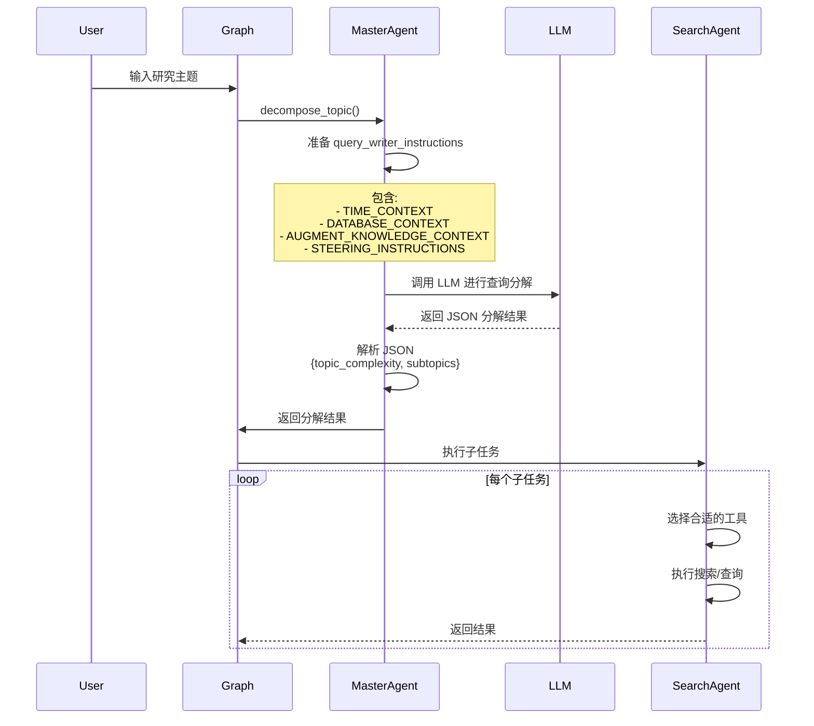
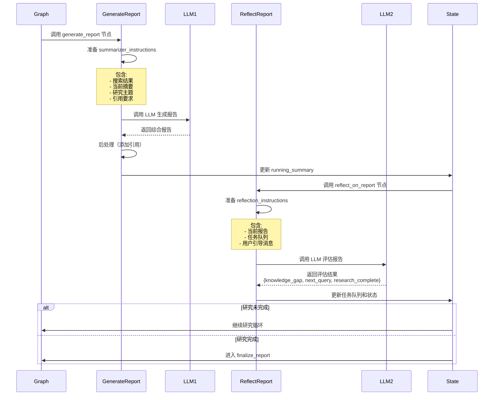
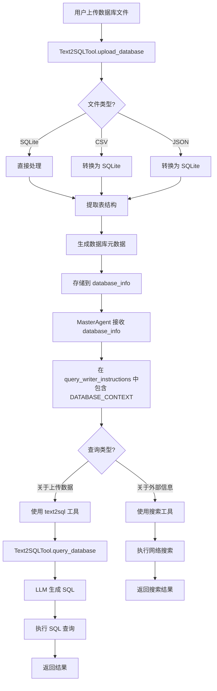
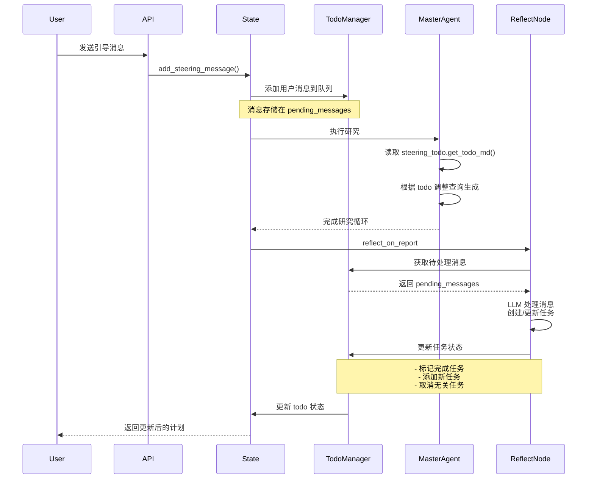
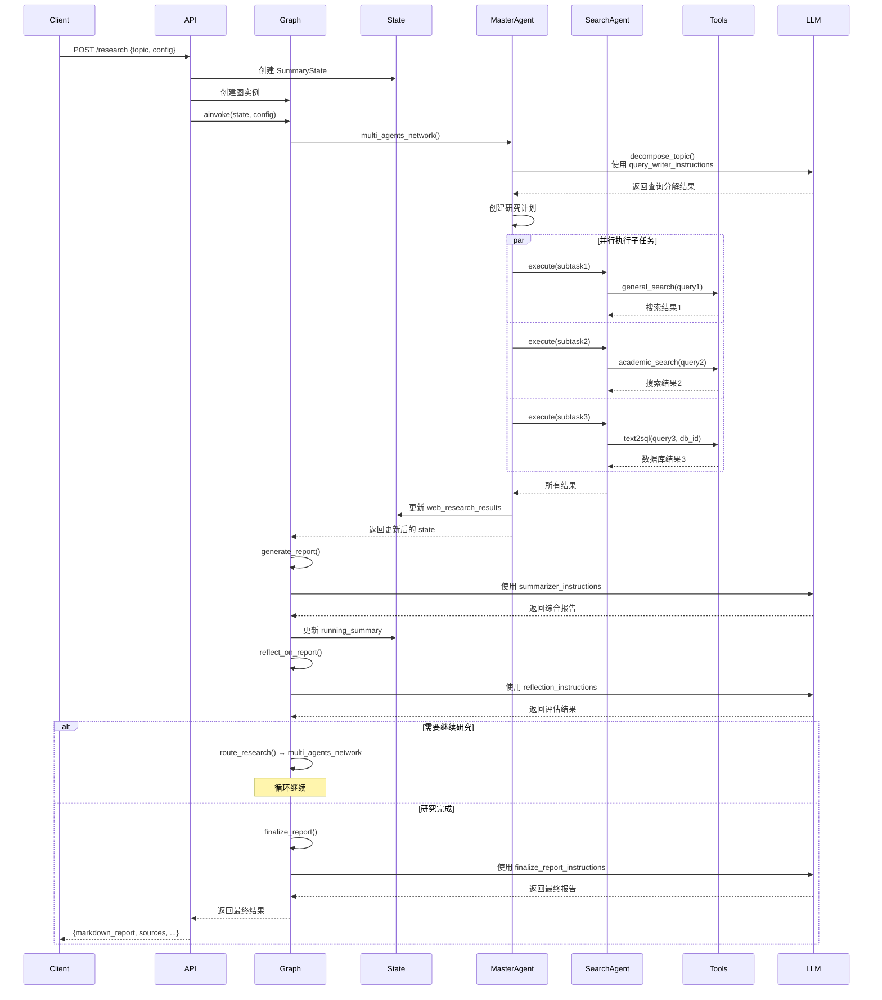
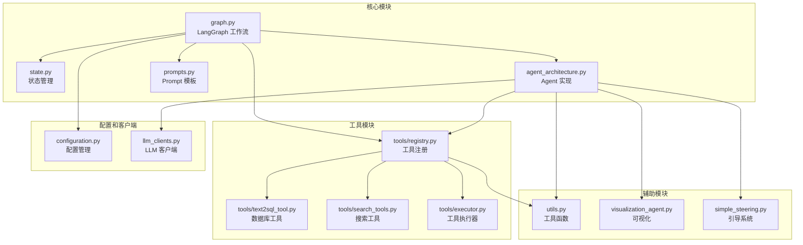

# Salesforce Enterprise Deep Research Agent 实现流程图

## 1. 系统整体架构图

## 2. Prompt 工程结构图

## 3. Agent 架构详细图

## 4. LangGraph 状态流转图

## 5. 查询分解流程详细图

## 6. 报告生成和反思流程

## 7. 数据库查询集成流程

## 8. Steering 系统工作流

## 9. 完整调用时序图

## 10. 代码模块依赖关系

---

## 关键代码位置索引

### 主要入口点
- **图创建**: `src/graph.py:5189` - `create_graph()`
- **主节点**: `src/graph.py:284` - `async_multi_agents_network()`
- **状态定义**: `src/state.py:22` - `SummaryState`

### Agent 实现
- **主控 Agent**: `src/agent_architecture.py:29` - `MasterResearchAgent`
- **搜索 Agent**: `src/agent_architecture.py:2029` - `SearchAgent`

### Prompt 定义
- **查询分解**: `src/prompts.py:4` - `query_writer_instructions`
- **报告生成**: `src/prompts.py:411` - `summarizer_instructions`
- **报告反思**: `src/prompts.py:781` - `reflection_instructions`
- **报告最终化**: `src/prompts.py:1391` - `finalize_report_instructions`

### 工具实现
- **Text2SQL**: `src/tools/text2sql_tool.py:22` - `Text2SQLTool`
- **工具注册**: `src/tools/registry.py` - `ToolRegistry`
- **工具执行**: `src/tools/executor.py` - `ToolExecutor`

### 路由决策
- **研究路由**: `src/graph.py:3138` - `route_research()`
- **多智能体后路由**: `src/graph.py:5218` - `route_after_multi_agents_decision()`

